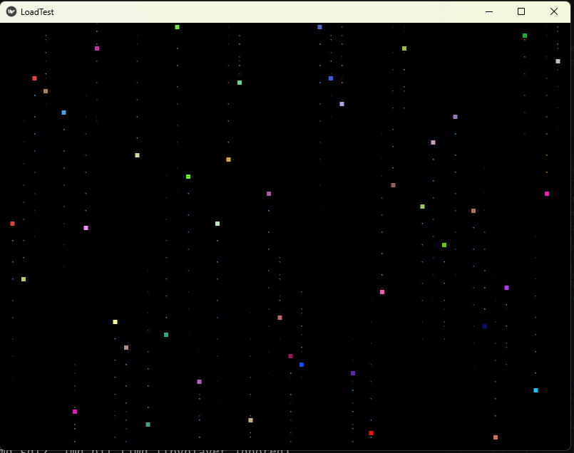
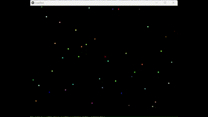

# Utils
Utilities

## List of Utilities
1. load_test.py
    - CPU Load test utility written in Python.
2. load_test_kivy.py  
    - CPU Load test using Kivy for a GUI Interface. (Under development)
    - Run as:
        - python python\load_test_kivy.py -- 7
            * For 20 Threads per CPU core Process
        - python python\load_test_kivy.py
            * Default is 1 Thread per Process
        - python python\load_test_kivy.py -- 2 0.2
            * Launch with 2 Threads per process and slow down by 0.2 seconds per Thread step.

## Screen Shots
1. load_test.py  
      
      
      
2. load_test_kivy.py  
      
      

## Kivy for Animation
Kivy is an Open Source Python App Development Framework. It can be used to Build and distribute beautiful Python cross-platform GUI apps with ease. Kivy runs on Android, iOS, Linux, macOS and Windows.  
"load_test_kivy.py" is using kivy framework.

### Installing Kivy
Here are power shell commands to install Kivy venv.  
Please refer to [Kivy-Docs](https://kivy.org/doc/stable/gettingstarted/installation.html) for your platform steps.

```pwsh
python -m pip install --upgrade pip setuptools virtualenv
python -m venv C:\Users\User1\kivy_venv
C:\Users\User1\kivy_venv\scripts\activate.ps1
python -m pip install "kivy[base,media]"
```
